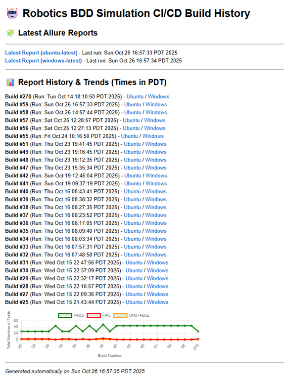
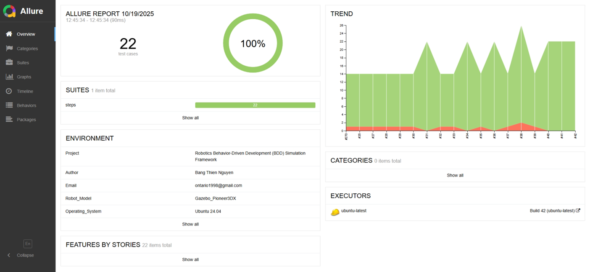
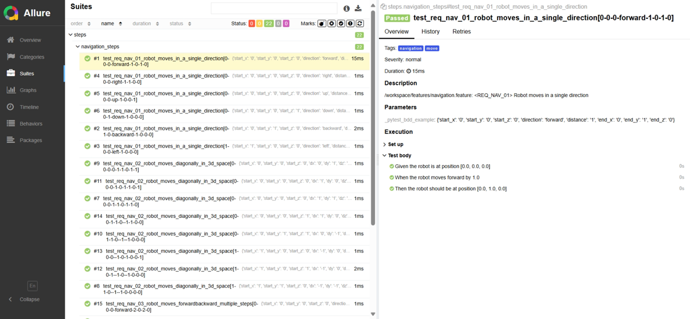

# 🤖 Robotics BDD Framework

## 🧠 Overview

> A Behavior-Driven Development (BDD) testing framework that integrates **Robot Framework**, **Allure Reporting**, and **Kubernetes (K8s)** orchestration for scalable, production-grade CI/CD automation.

This repository enables automation teams to:

* Write human-readable test cases with **Gherkin syntax**.
* Run tests locally or in **distributed cloud-native environments**.
* Automatically generate and host **interactive Allure reports**.
* Integrate with **Docker** and **Kubernetes Jobs** for high scalability.

---


---

## 🛠️ End-to-End DevOps & Kubernetes Workflow

This project is built on a comprehensive CI/CD pipeline and an automated Kubernetes deployment workflow:

### 1. Development & Testing (Local/CI)
* **Testing**: Developers run benchmarks locally using **Pytest** with specific markers (`-m gpu`, `-m cpu`) to validate performance and collect detailed results.
* **CI/CD (GitHub Actions / Jenkins)**: The **`ci.yml`** workflow in GitHub Actions (or an equivalent Jenkins pipeline) is triggered upon code changes.
    * It executes the **benchmark tests** against various hardware configurations.
    * It uses **Docker** to ensure a consistent, reproducible environment for testing.
    * It generates **Allure Reports** and plots system metrics (`scripts/plot_gpu_metrics.py`).

### 2. Packaging & Publishing
* **Docker Image Creation**: Using one of the provided `Dockerfile` variants (`Dockerfile.mini`, `Dockerfile.report`), a Docker image containing the test environment, report server, and dependencies is built.
* **Registry Push**: The final image is tagged and pushed to **Docker Hub** (or a private registry).

### 3. Automated Kubernetes Deployment
The **`deploy_gpu_workflow.py`** script manages the final deployment to a Kubernetes cluster:
* **Cluster Cleanup**: It first runs `kubectl delete deployment --all` for a clean state.
* **Dynamic GPU Detection**: It scans cluster nodes for available extended GPU resources (e.g., `gpu.intel.com/i915`, `nvidia.com/gpu`).
* **Resource Allocation**: The deployment manifest is dynamically configured to request the detected **GPU resource** or fall back to standard **CPU limits (1 core / 1Gi)**.
* **Deployment & Access**: It creates the optimized Kubernetes Deployment and Service. Once the Pod is running, it initiates a blocking **`kubectl port-forward`** to map the cluster service (Port 80) to your local machine (Port 8080), allowing instant, interactive access to the Allure Report dashboard via `http://127.0.0.1:8080`.

---

## 🧩 Key Features

* **Robot Framework + Allure** for structured, visual, and traceable test reporting.
* **Cross-platform CI/CD**: Works on Windows (ci.bat) and Linux (ci.sh) agents.
* **Dockerized Test Execution** ensures consistency and easy environment setup.
* **Kubernetes Integration** to offload workloads to production-like clusters.
* **GitHub Actions / Jenkins** support for CI/CD pipelines.

---


## 🏷️ Test Tags & Execution  

| **Tag** | **Focus Area** | **Description** |
|----------|----------------|-----------------|
| `navigation` | Path Planning | Safe movement, obstacle avoidance, waypoint following. |
| `pick_and_place` | Manipulation | Object handling, kinematics, and dynamic interactions. |
| `safety` | System Integrity | Collision prevention, boundary constraints, error handling. |
| `walking` | Gait Control | Posture, speed, stability, locomotion transitions. |
| `sensors` | Data Fusion | Sensor accuracy and Kalman Filter convergence. |
| `security` | System Security | System security checks. |

---


## ⚙️ Setup Instructions

### 1. Local Environment Setup

```bash
git clone https://github.com/<your-org>/robotics-bdd-framework.git
cd robotics-bdd-framework
pip install -r requirements.txt
pytest --alluredir=allure-results
allure serve allure-results
```

### 2. Run Tests Locally (Without Docker)  

| **Mode** | **Command** |
|-----------|-------------|
| Run All Tests | `pytest --verbose` |
| Run by Tag | `pytest -m sensors --verbose` |
| Sequential (OR) | `pytest -m "navigation or pick_and_place"` |
| Parallel | `pytest -m "navigation or safety" -n auto` |


### 3. Run with Docker

```bash
docker build -t robotics-bdd:latest .
docker run --rm -v $(pwd)/reports:/reports robotics-bdd:latest

or python run_docker.py <build_number> [test_suite]

```

## 4. Run Advanced CI/CD with Kubernetes & Docker
```bash

Usage:   python run_kubernestes.py <Build_Number> [Suite_marker] [Dockerfile]
Example: python run_kubernestes.py 1 -m navigation Dockerfile.custom
-> Builds Docker images with , runs Robotics BDD Framework with  with build number 1, 
-> Generates Allure report, and pushes Docker images to Docker Hub.

Usage:   python deploy_gpu_workflow.py <Build_Number>
Example: python deploy_gpu_workflow.py 1
-> Creates the necessary Pod deployment and service, monitors Pod creation & reports scheduling events.
-> Deploys Docker image (build tag number 1) from Docker Hub, assigns a worker to run the Docker image within the assigned Pod.
-> Generates Allure Report.


```

---


## 📊 Allure Reporting

To generate and serve the Allure Report locally:

```bash
pytest --alluredir=allure-results
allure generate allure-results --clean -o allure-report
allure open allure-report
```

📸 *Preview:* 







> Opens an interactive HTML dashboard locally with detailed execution insights.

> The CI pipeline will automatically attach and publish the generated reports as artifacts.

---

## 🧱 Project Structure

```
robotics_bdd/
├─ BUILD_NUMBER.txt           # File storing current build number.
├─ Dockerfile                 # Defines the BDD Test Docker image (runtime environment).
├─ Dockerfile.mini            # Minimal Docker build file
├─ Dockerfile.report          # Docker build file for the report server
├─ Jenkinsfile                # CI/CD pipeline definition for Jenkins.
├─ README.md
├─ requirements.txt			  # dependencies requirements
├─ run_docker.py			  # python script to run tests insie docker container.
├─ run_kubenestes.py          # Python script to orchestrate K8s jobs and report generation.
├─ kubenestes_pipeline.bat    # CI execution script.
├─ configs/                   # Kubernetes job configurations
├─ .github/                   # GitHub Actions CI/CD workflows
├─ features/                  # Gherkin feature files
│  └─ manual_tests/
├─ steps/                     # Python step definitions (pick_and_place_steps.py, navigation_steps.py, etc.)
├─ simulation/                # Robot simulation and core logic (robot_sim.py, sensors.py)
├─ reports/         	      # Static HTML docs (Test plan, PRD summary, metrics)
├─ allure-report/             # Dynamic history report files
└─ allure-results/            # Raw JSON/XML results (generated during test execution)

---

## 🧩 Contributing

1. Fork the repository
2. Create a new branch (`feature/awesome-enhancement`)
3. Commit your changes
4. Open a Pull Request

---

## 🪪 License

Released under the **MIT License** — free to use, modify, and distribute.

---

📬 *Contact:* Bang Thien Nguyen [ontario1998@gmail.com](mailto:ontario1998@gmail.com) 

---

> _“Build robots that test themselves before they move. That’s a true autonomy.”_
